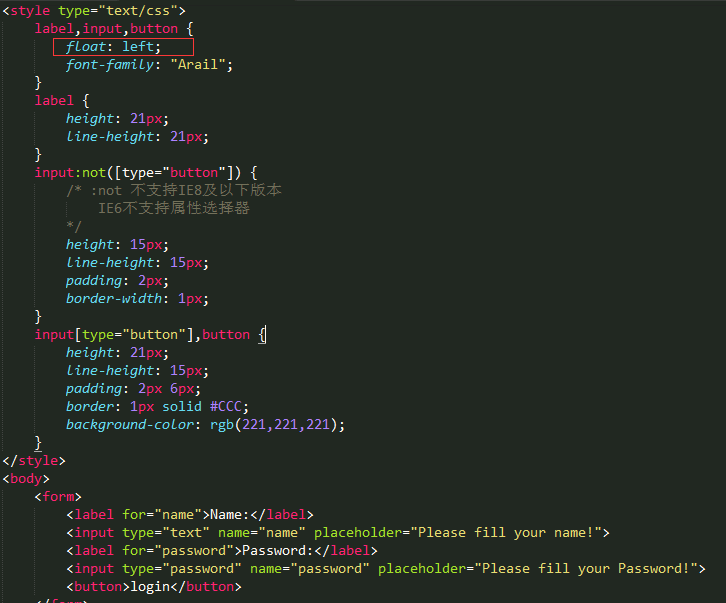

# compatible-summary
# IE游览器单独写CSS样式的几种方法

## 1.CSS Hack 
举例如下：
```
.box {  
    background: gray; /* 基本的 */ 
    background: yellow\0; /* IE8/IE9/IE10/IE11生效 */
    background: black\9\0;/* IE8/IE9/IE10/生效 */
    background: pink\9; /* IE6/IE7/IE8/IE9/IE10生效 */
    *background: green; /* IE6/IE7生效 */
    +background: green; /* IE6/IE7生效 */
    _background: blue; /* IE6生效 */
}
```
`另外网上找到的下面这张表可以很清楚的像大家展示IE各版本的css hack。`


`这里S代表standard标准模式，Q代表Quirks怪异模式 `

<br>

# 2.条件注释
```
<!--[if lt IE 7]>版本小于IE7将看到这行<![endif]-->
<!--[if lte IE 7]>版本小于或等于IE7将看到这行<![endif]-->
<!--[if IE 7]>版本如果是IE7将看到这行<![endif]-->
<!--[if gt IE 7]>版本大于IE7将看到这行<![endif]-->
```
很明显具体格式是if 运算符 IE 版本号，运算符如果省略将意味着等于，否则请取lt（小于）、gt（大于）、lte（小于或等于）、gte（大于或等于），另外还可以进行感叹号（!）逻辑取非和 | 逻辑或等运算，这个将在第三种方法介绍中给出实例

具体使用在html中这样写：
```
<!--[if IE 6]>
<style type="text/css">
 /* 针对IE6定义的样式 */
</style>
<![endif]-->
```
当然除了定义style样式外我们还可以针对不同IE浏览器定义不同的内容，可以是script脚本或者其他显示或隐藏的内容等。

# 3.条件注释 html 标签
 这种方案也是利用条件注释，但并不是对 CSS 使用条件注释，而是对 html 标签使用条件注释，引入不同的 class ，从而区分不同的 IE 以及其他浏览器。例如：

```
<!DOCTYPE html>
<!--[if lt IE 7 ]> <html class="ie6"> <![endif]-->
<!--[if IE 7 ]> <html class="ie7"> <![endif]-->
<!--[if IE 8 ]> <html class="ie8"> <![endif]-->
<!--[if IE 9 ]> <html class="ie9"> <![endif]-->
<!--[if (gt IE 9)|!(IE)]><!--> <html> <!--<![endif]-->
<head>
<style type="text/css">
.box {
    color: #fff; 
    padding: 5px 20px;
    background: gray; 
}
.ie8 .box {
    background: pink;
}
.ie7 .box {
    background: green;
}
.ie6 .box {
    background: blue;
}
</style>
</head>
<body>
<div class="box">
Content here
</div>
</body>
</html>
```


# 游览器兼容性总结

## 游览器内核(渲染引擎)
*  1.Trident 代表游览器:IE...
*  2.Gecko 代表游览器:Mozilla Firefox...
*  3.Presto 代表游览器:Opera...
*  4.Webkit 代表游览器:Safari Chrome...
*  5.Blink 由Google和Opera开发的游览器排版引擎2013年4月发布。

*  1.CSS Bug: CSS样式在各游览器中解析不一致的情况，或者说CSS样式在游览器中不能正确显示的问题称为CSS Bug.
*  2.CSS Hack: CSS中,Hack是指一种兼容CSS在不同游览器中正确显示的技巧方法，因为它们都属于个人对CSS代码的非官方修改，或非官方补丁。
*  3.Filter: 表示过滤器的意思，它是一种对特定的游览器或游览器组显示或隐藏规则或声明的方法。本质上，Filter是一种用来过滤不同游览器的Hack类型。
*  使用Hack带来的一些副作用：降低了CSS代码的可读性，增加了代码的负担。


# 常见CSS解析Bug及Hack

###  1. 图片有边框(IE6,7,8,9)
问题描述：当图片放在 a 标签内 会在IE上出现蓝色边框<br />
示例图片：<br />
<br />
Hack：给图片加border:0;或者border:none;<br />
Hack_Code:<br />


### 2. 图片间隙(所有游览器)
问题描述：img标签嵌套在其他标签(a,div等等)中会产生3-6px的间隙<br />
嵌套在a标签中示例图片：<br />
<br />
嵌套在div标签中示例图片：<br />
<br />
Hack: 给图片设置 display:block;或者 设置浮动(浮动会产生一个块级元素)<br />
Hack_Code: <br />


### 3. 双倍浮向(双倍边距) (IE6)
问题描述：当IE6及更低版本游览器在解析浮动元素时，会错误的把浮向边边界(margin)加倍显示。<br />
正常示例图片：<br />
<br />
IE6下示例图片：<br />
<br />
Hack: 给浮动元素添加声明 _display:inline(_只针对IE6输出此行) <br />
Hack_Code:<br />


### 4. 默认高低(IE6) 
问题描述：在IE6版本中，部分块元素拥有默认高度(16-20px左右)；<br />
正常示例图片:<br />
<br>
IE6下示例图片：<br />
<br>
Hack1: 给元素添加声明 _font-siez:0;<br>
Hack1模式IE6中显示仍比正常游览器粗，示例图片：<br>
<br>
Hack2: 给元素添加声明 _overflow:hidden <br>
Hack_Code:<br>


### 5.表单元素行高对齐不一致(所有游览器)
问题描述：表单元素行高对齐方式不一致<br>
Hack: 给表单元素添加声明 float:left;<br>
Notice:设置浮动之后仍然会有FireFox，IE11 与其他现代游览器不一致，可以设置label,input,button等元素的内容高度，border,padding与chrome,opera等游览器看齐！仍然需要注意的是：这个方法不支持IE11以下版本IE游览器！<br>
Hack_Code:<br>


### 6.百分比bug
问题描述：在IE7及以下版本中解析百分比时，会按四舍五入方式计算从而导致50%加50%大于100%的情况。（也会受到系统影响）
Hack: 给右面的浮动元素添加对应的清楚浮动声明 *clear:right; 
```
<style type="text/css">
    .container {
        width: 100%;
        background-color: #CCC;
    }
    .left {
        float: left;
        background-color: red;
        width: 50%;
        height: 60px;
    }
    .right {
        float: right;
        background-color: blue;
        width: 50%;
        height: 60px;
        *clear: right;
    }
    .right:after {
       content:""; 
       display: block; 
       clear:both; 
    }
</style>
<body>
    <div class="container">
        <div class="left"></div>
        <div class="right"></div>
    </div>
</body>
```
<a href="http://blog.csdn.net/qq_20087231/article/details/79630426" rel="external nofollow" target="_blank" title="清除浮动的各种方法及原理">清除浮动的各种方法及原理</a>

### 7.透明属性(IE8及以下版本)
兼容其他游览器写法 opacity:value;(value取值范围0-1)；
IE中写法 filter:alpha(opacity=value)(value取值范围1-100整数)

### 8.li列表的BUG
>问题描述：li中嵌套a标签时，父元素li有float:left;子元素a没设置浮动的情况下会出现垂直bug；
>Hack：给父元素li和子元素a都设置浮动
>>问题描述：当给li中的a转成block，并且有height,float时，li中没设置浮动会出现阶梯显示；(针对所有游览器)
>>Hack: 同时给li加float;

### 9.当前元素(父元素里面第一个子元素)与父元素没有设置任何浮动的情况下，设置margin-top后，会错误的把margin-top加在父级元素上（针对IE8及以上游览器及其他游览器）
Hack1: 给父级元素添加overflow:hidden;(推荐使用)
Hack2: 给父元素或子元素添加浮动

### 10.png24位的图片在iE6浏览器上出现背景，解决方案是做成PNG8.

### 11.浏览器默认的margin和padding不同。解决方案是加一个全局的*{margin:0;padding:0;}来统一。

### 12.Chrome字体BUG
问题描述：中文界面下默认会将小于 12px 的文本强制按照 12px 显示
Hack:可通过加入 CSS 属性 -webkit-text-size-adjust: none; 解决。

### 13. 超链接访问过后hover样式就不出现了 被点击访问过的超链接样式不在具有hover和active了解决方法是改变CSS属性的排列顺序:
    `L-V-H-A :  a:link {} a:visited {} a:hover {} a:active {}`


# 常见JS兼容性问题

### 1.IE和Firefox获取常规属性方法不同
    问题描述：IE下,可以使用获取常规属性的方法来获取自定义属性,也可以使用getAttribute()获取自定义属性;Firefox下,只能使用getAttribute()获取自定义属性。
    解决方法:统一通过getAttribute()获取自定义属性。

### 2.IE与Firefox Event对象属性不同
    问题描述：IE下,even对象有x,y属性,但是没有pageX,pageY属性;Firefox下,event对象有pageX,pageY属性,但是没有x,y属性。
    解决方法：（条件注释）缺点是在IE浏览器下可能会增加额外的HTTP请求数。